# scrollerList的使用
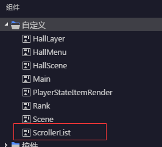

可以通过直接拖拽的方式来创建scrollerList，将其拖动到exml文件中
然后将其

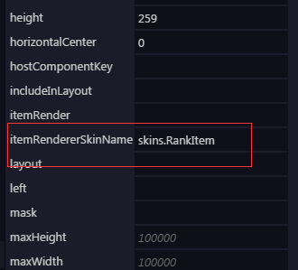

itemRenderSkinName赋值，绑定具体的item的皮肤,
也可用代码来对其进行皮肤的绑定，item的皮肤如下：

相应的exml源码如下：

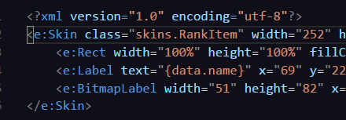

注意之前的itemRenderSkinName和此class要对应，

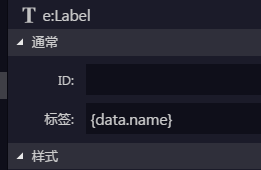

这里的data.name利用了其数据的双向绑定的原理

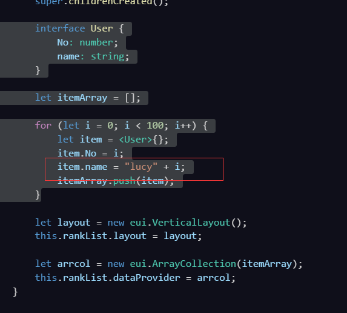

可以直接对其赋值，不需要通过额外的变量来控制

具体item的点击事件如下

可以对其布局来赋值产生不同的布局方式

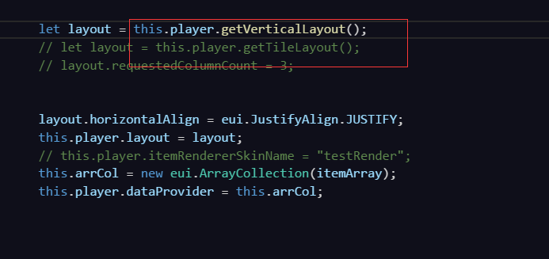

效果图：垂直布局

效果图：水平布局:

单纯的list列表可以通过编辑器来进行数据的设定

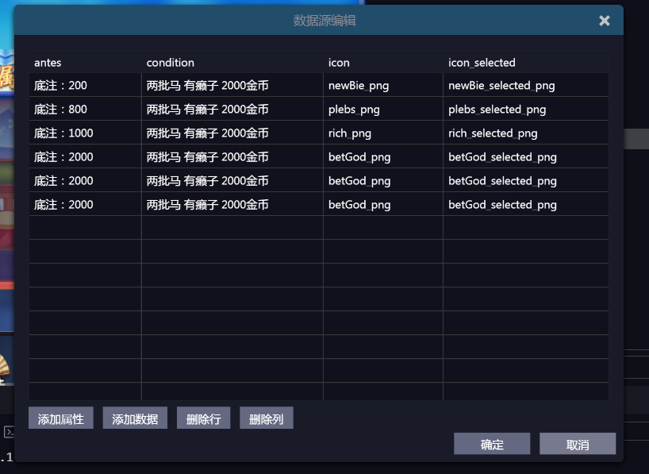

具体的属性和itemRender的属性对应

# PopUpManager的使用
先创建自己的layer

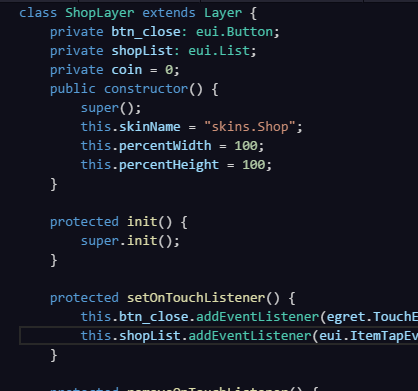

在viewconstant注册

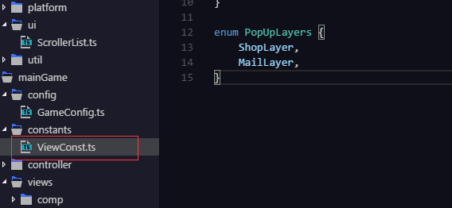

打开面板

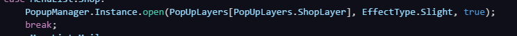

# tabView的使用

和scrollerList一样拖拽到exml文件里
然后指定皮肤为以下的

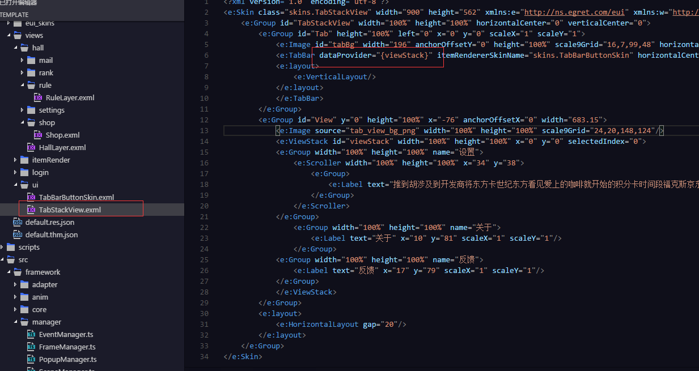

以TabStackView为模板来建立你的tabView文件
注意tab的dataProvider属性定义为viewstack

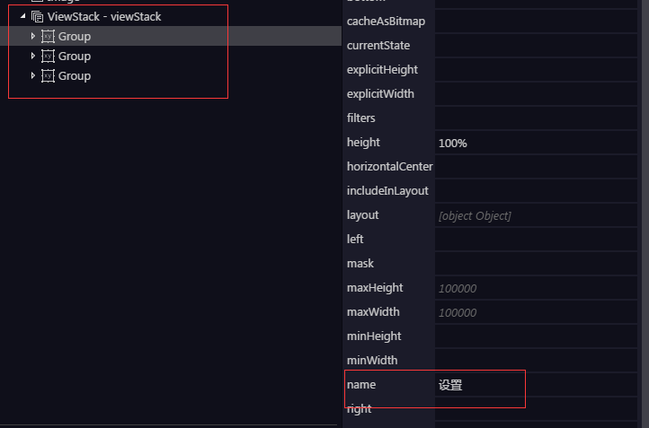
每添加一个组，将其name赋值为tab上想要显示的内容

egret编辑器直接看效果图
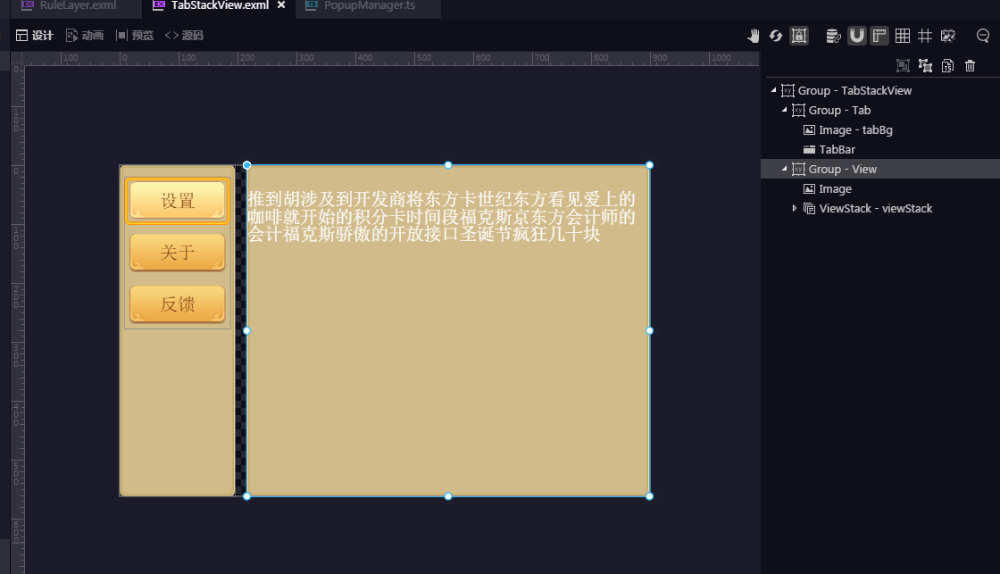

